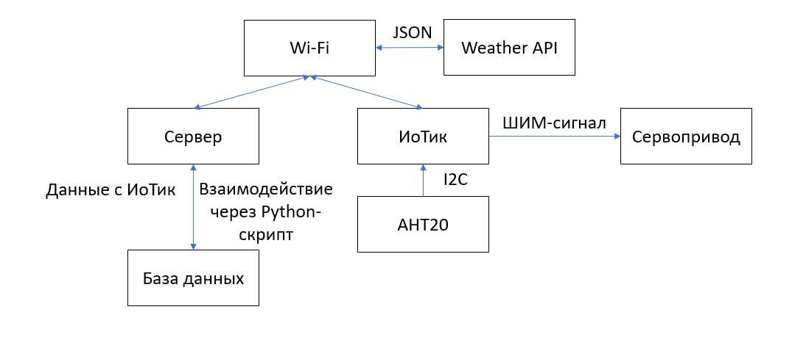
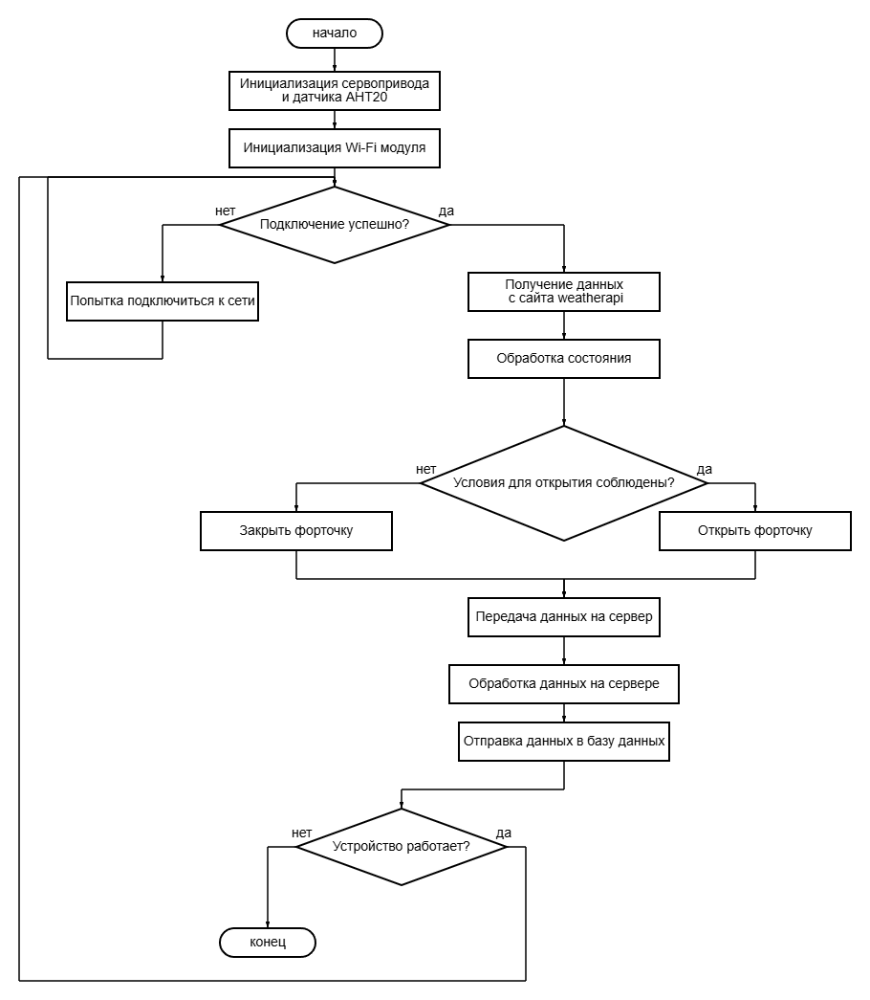
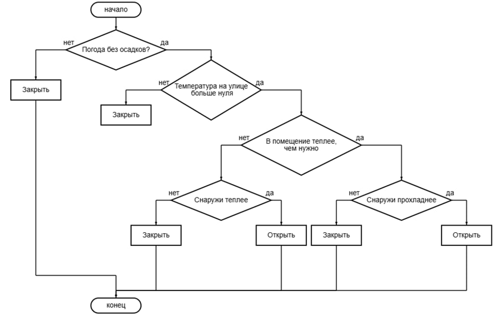
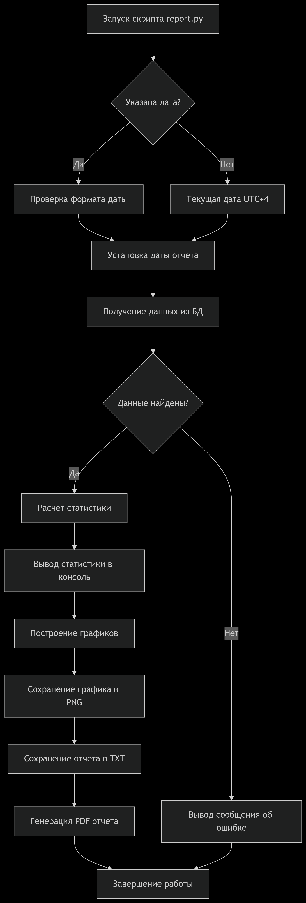

# Мониторинг и управление системой проветривания для нагнетания свежего воздуха и поддержки заданной температуры

## Комплектация

1. ИоТик или ESP32
2. AHT20
3. Сервопривод
4. Для мощного сервопривода нужен источник питания

## Схема подключения


## Общая схема системы


## Зависимости

Для программирования использовалась Arduino IDE.

### Библиотеки ESP32
1. ArduinoJson.h - библиотека для сериализации и десериализации JSON
2. AHT20.h - библиотека для работы с датчиком температуры и влажности AHT20

### Библиотеки Python
1. Flask - необходим для создания сервера
2. Reportlab - библиотека для генерации отчётов в формате PDF
3. Matplotlib - библиотека для создания графиков

### Прочее
1. sqlite3 - работа с базами данных
2. Шрифты - настройка шрифтов происходит в report.py

Остальные зависимости скачиваются вместе с остальными библиотеками. При необходимости установить их вручную. Сервер тестировался на Ubuntu 22.04.

## Подготовка к работе

### Настройка клиента ESP32
1. ``` const char* SERVER_URL = "http://192.168.1.61:5000/data"``` - указать ip сервера
2. ```wifiMulti.addAP("SSID", "PASSWORD");``` - указать данные Wi-Fi для подключения
3. ```http.begin("API KEY");``` - указать адрес с api ключом сервиса weatherapi
4. ```const int goodConditions[] = {1000, 1003, 1006, 1009, 1030, 1063};``` - в файле functions.cpp можно установить коды погодных условий, для которых можно открывать форточку
5. ```const int OPEN_ANGLE = 90; const int CLOSE_ANGLE = 0; const int UPDATE_PERIOD = 5000; const float DESIRED_TEMPERATURE = 20;``` - настройка параметров работы системы

### Настройка сервера 
1. ```app.run(host='192.168.1.61', port=5000, threaded=True, debug=True)``` - необходимо указать локальный ip ПК в сети, при необходимости debug установить false


## Алгоритм работы

Общий алгоритм работы:


Алгоритм принятия решений по открытию и закрытию:


Алгоритм создания отчётов:
